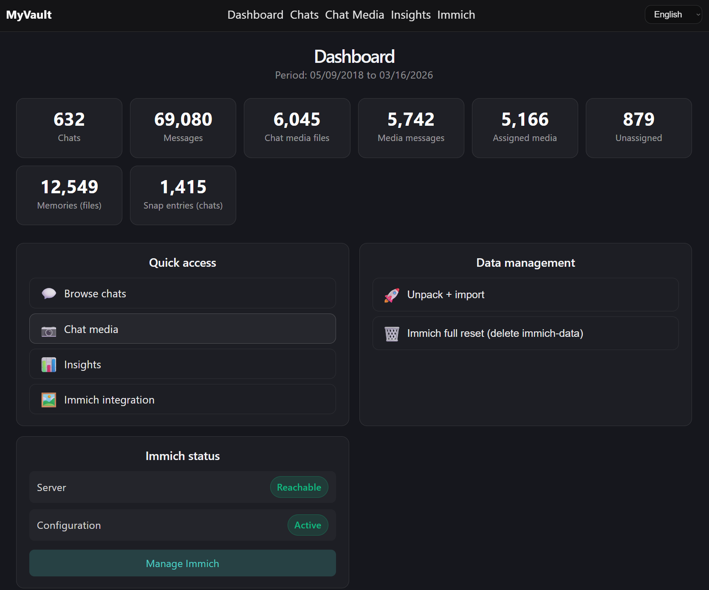
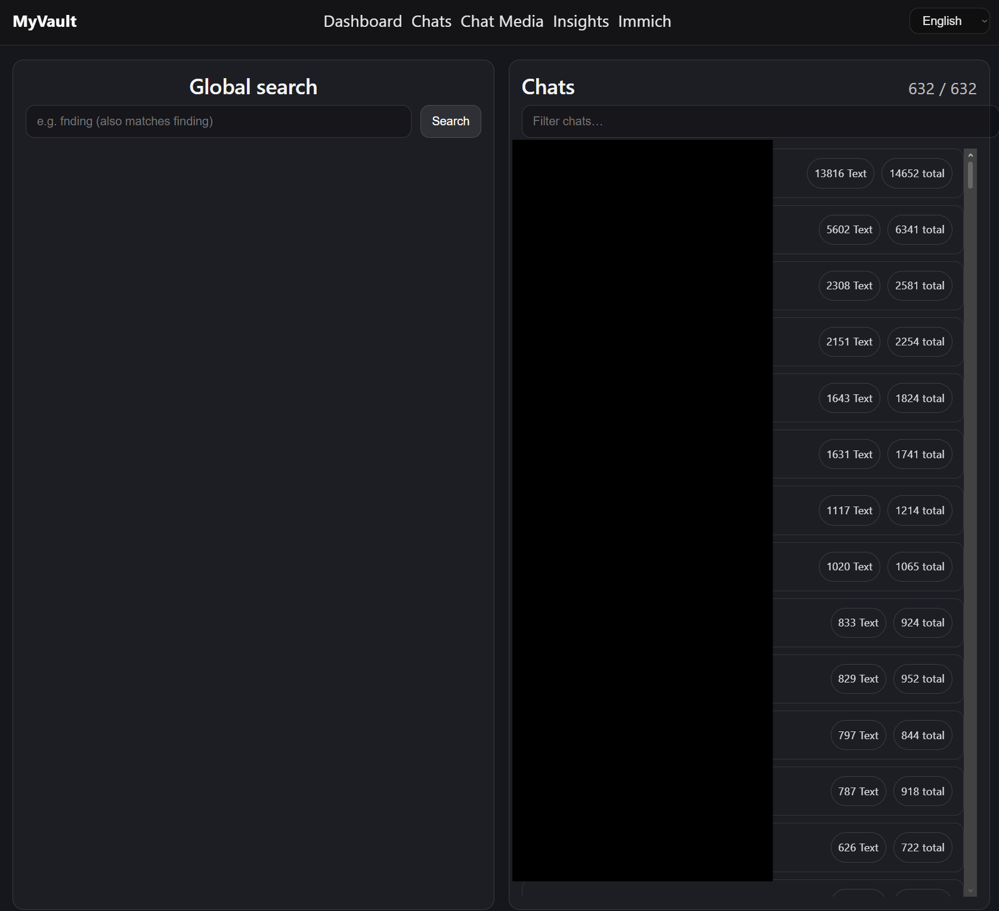
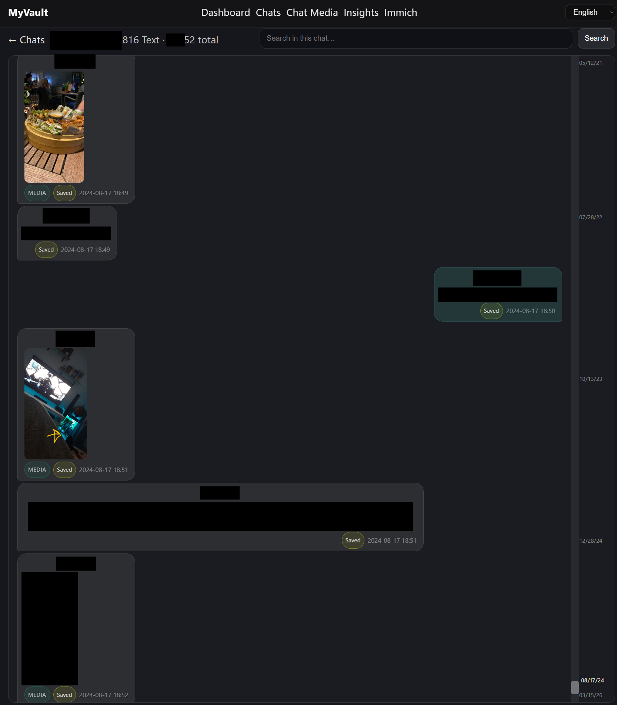
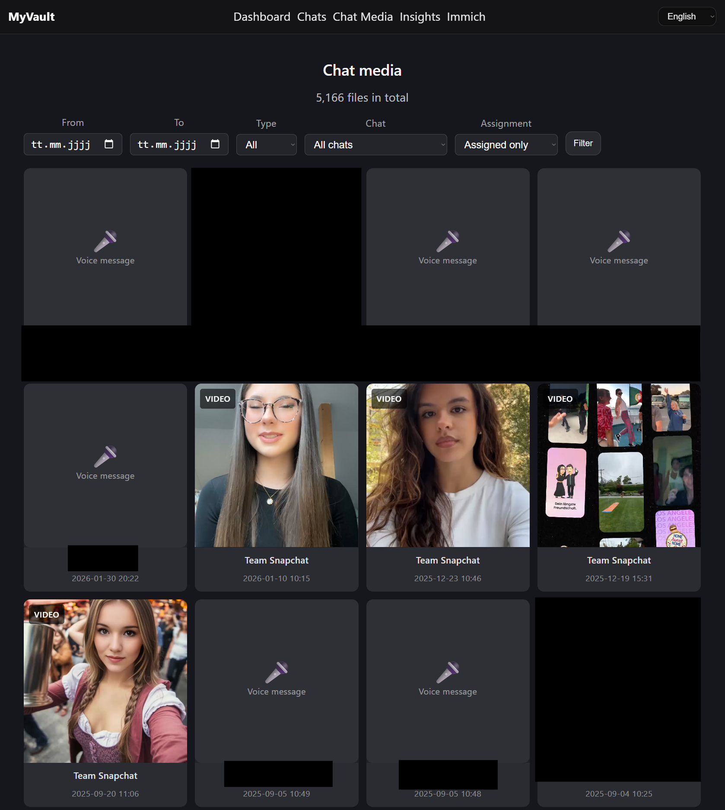
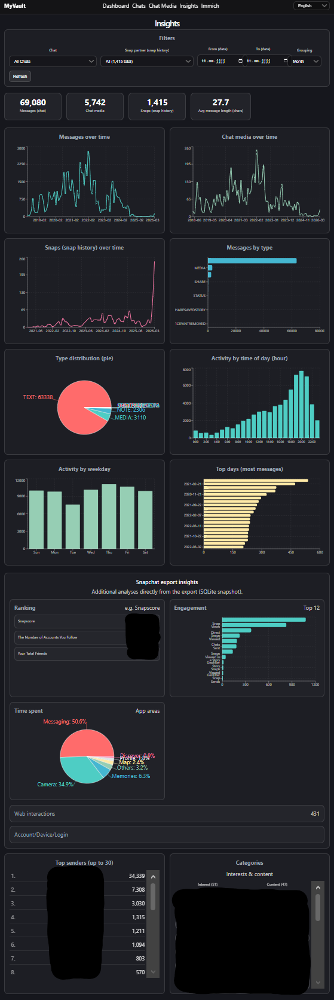
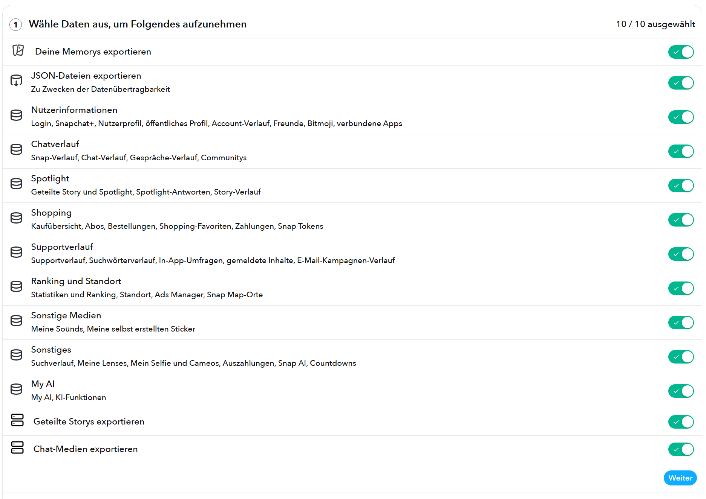
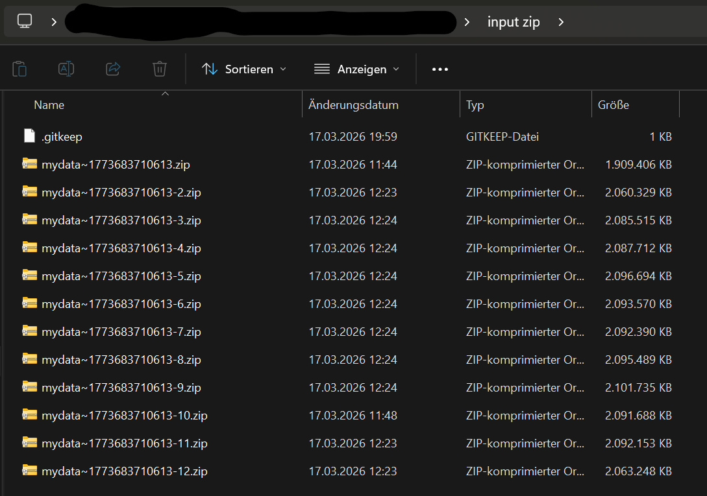

# MyVault – Chat & Memories Vault for Snapchat Export (Docker)

MyVault makes your **Snapchat “My Data” export** searchable locally and provides a web UI for chats, media/snaps, statistics/insights.

> Disclaimer: This project is **not affiliated with, endorsed by, or connected to** Snapchat or Snap Inc.  
> "Snapchat" is a trademark of Snap Inc. and is used here **only to describe compatibility** with exported data.
> "Immich" is used in this programm. The immich repo can be viewed here: `https://github.com/immich-app/immich`

## The problem

Snapchat offers very limited ways to meaningfully use your own data:

- **No search** – You can’t search chats or snap history by text/people; you have to scroll manually.
- **Memories are hard to browse** – Memories are a big list without grouping by person/context; finding specific photos/videos is tedious.
- **Chat media is poorly organized** – Images/videos from chats are not easily sortable by chat/date/person.
- **Storage** – Snapchat recently announced a storage limit for non premium users

The official “My Data” export gives you raw files, but no good interface to explore them.

## What MyVault does

MyVault turns your Snapchat export into a **searchable local vault** and provides these areas:

- **Dashboard** – Overview (chat/message/media/snap/memory counts), quick links, and **data management** (unpack ZIPs, run import).
- **Chats** – Chat list with message counts; open a chat view with **in-chat search** (highlight + jump). Also includes **global search** across all chats.
- **Chat media** – Gallery of all chat images/videos with filters (date, type, chat).
- **Insights** – Charts/statistics for chats & snaps plus additional analyses from the export (e.g. engagement, time spent, categories, ranking, account/device/login).
- **Immich** – Sync Memories + chat media into Immich, organized into albums (see below).

### Screenshots

| Dashboard | Chats | Chat |
|-----------|-------|------|
|  |  |  |

| Chat media | Insights |
|------------|----------|
|  |  |

## Requirements

- **Docker**
- Optional for Immich GPU (CPU works fine as well, only ML from Immich is slower): NVIDIA driver + Container Toolkit

## Quickstart (Windows)

### 1) Clone repo

```bash
git clone https://github.com/leofleischmann/chats-and-memories-vault-for-snapchat-export.git
cd chats-and-memories-vault-for-snapchat-export
```

### 2) Start the app

- **Without Immich:** `scripts/start-app.bat`
- **With Immich (CPU):** `scripts/start-immich-cpu.bat`
- **With Immich (GPU/NVIDIA):** `scripts/start-immich-gpu.bat`
- **Stop everything:** `scripts/stop-all.bat`

### 3) Open in your browser

- App: `http://localhost:5173`

## Import data (via Dashboard)

1. **Get your Snapchat export**  
   In the Snapchat app, request your “My Data” export, or use the web link: [Download My Data (Snapchat)](https://accounts.snapchat.com/v2/download-my-data). You’ll receive one or multiple ZIP files.

   

2. **Put ZIPs into the folder**  
   Copy all downloaded ZIP files into **`input_zip/`** in this project.

   

3. **Run import**  
   Open `http://localhost:5173` → **Dashboard** → **Data management**, then:

   - **Unpack + import ** – unpacks ZIPs into `input/` (chat_media, memories, JSON, etc.) and starts the import process.

     

   - **Immich (optional)** – if Immich is running: go to **Immich** → click **Start sync**.

       
     
     Everything from immich account setup to moving your files into immich will be handled automatically.
     You can choose if you want to move the images with or without the Snapchat overlay to immich. Note: This can only be chosen at the first sync.


## Importing newer exports later

When you request a new “My Data” export, Snapchat **typically** includes your previous data plus new data. (This is common behavior, but not a strict guarantee.)

Recommended workflow months later:

1. Put the new ZIP(s) into `input_zip/` (delete old ZIPs).
2. Dashboard → **Unpack + import**
3. Immich → **Start sync**
   - The sync can skip already-uploaded files locally without re-checking every file on the Immich server.
   - Immich also detects duplicates and won’t upload assets twice.
   - This helps preserve Immich data like face/person assignments as long as you **do not reset Immich**.
   - If a medium is assigned to a chat in a newer export, the next sync can additionally place it into the matching chat album.

## Immich organization (if you use sync)

- Album **“Snapchat Memories”** – all Memories main files (overlays are skipped when not checked in first sync process). When uploading, MyVault sets **timestamp + GPS coordinates** (if available) from `json/memories_history.json` as metadata in Immich.
- Album **“Snapchat Shared Story”** – content from `shared_story/` (including date/type from `json/shared_story.json`).
- Album **“Chat: <Chat title>”** – media for that chat.
- Album **“Chat media (unassigned)”** – media without a linked message.
